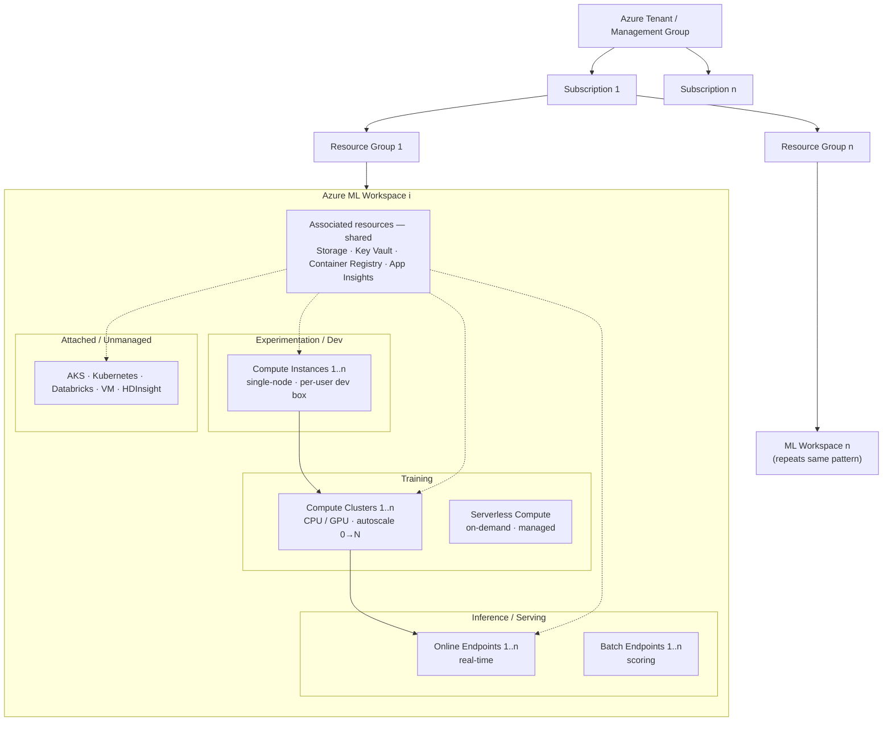

# Azure Machine Learning — Workspaces & Compute Segregation

This document describes how an Azure Machine Learning (Azure ML) estate is structured in
terms of **workspaces** and **compute segregation**. It provides a generic `1 … n` topology
suitable for inclusion in a paper, followed by a concrete worked example.

The structure is always:

> **Subscription → Resource Group → Workspace → { shared associated resources + segregated compute }**

Segregation happens on three axes:

1. **Workspace axis** — per team / project / environment (dev · test · prod), each with its own
   RBAC and data isolation.
2. **Compute-type axis** — dev (compute instances) vs training (clusters / serverless) vs
   serving (endpoints) vs attached/unmanaged.
3. **Network / identity axis** — managed VNet, private endpoints, managed identity, and
   per-user compute-instance assignment.

---

## 1. Generic topology (1 … n)

**Reading the diagram**

- The solid `CI → CC → OE` path is the ML lifecycle (develop → train → serve).
- Dotted lines show that all compute in a workspace **shares** the four associated resources.
- The four lanes are the **compute-type segregation** inside a single workspace.
- The fan-out `RG → Workspace n` is the **workspace-level segregation** that repeats per
  team / project / environment.

---

## 2. Worked example — enterprise dev/prod + two teams

```mermaid
flowchart TB
  SUB["Subscription: Contoso ML Platform"]
  SUB --> RGF["RG: rg-fraud  (Fraud Detection team)"]
  SUB --> RGD["RG: rg-forecast  (Demand Forecasting team)"]

  RGF --> WSFD
  subgraph WSFD ["Workspace: mlw-fraud-dev  —  Dev"]
    direction TB
    ARFD["Associated: stfrauddev · kv-fraud-dev<br/>acrcontoso (shared) · appi-fraud-dev"]
    CIA["CI: ci-alice  (data scientist)"]
    CIB["CI: ci-bob  (data scientist)"]
    CPU["Cluster: cpu-cluster<br/>DS3_v2 · 0→8"]
    GPU1["Cluster: gpu-cluster<br/>NC6 · 0→4"]
    EPD["Online Endpoint: fraud-dev<br/>test · 100% traffic"]
  end

  RGF --> WSFP
  subgraph WSFP ["Workspace: mlw-fraud-prod  —  Prod"]
    direction TB
    ARFP["Associated: stfraudprod · kv-fraud-prod<br/>acrcontoso (shared) · appi-fraud-prod"]
    NOCI["No compute instances<br/>personal dev boxes disabled by Azure Policy"]
    GPUT["Cluster: gpu-train-prod<br/>NC24 · 0→8 · scheduled retrain"]
    EPP["Online Endpoint: fraud-prod<br/>blue/green · managed identity"]
    BEP["Batch Endpoint: fraud-batch-score"]
  end

  RGD --> WSDD["Workspace: mlw-forecast-dev<br/>CIs + CPU cluster + dev endpoint"]
  RGD --> WSDP["Workspace: mlw-forecast-prod<br/>train cluster + prod endpoint · no CIs"]
```

**What the example demonstrates**

| Segregation | How it shows up |
| --- | --- |
| **Team / project** | `rg-fraud` vs `rg-forecast`, isolated workspaces, separate RBAC & cost reporting |
| **Environment (SDLC)** | `*-dev` vs `*-prod` workspaces with their own Storage / Key Vault / App Insights; only the Container Registry is shared |
| **Persona** | Dev workspaces have per-user compute **instances**; Prod has **none** (policy-disabled) |
| **Workload** | CPU vs GPU **clusters**, and training clusters separated from online/batch **endpoints** |
| **Reuse** | `acrcontoso` shared across workspaces (a hub-style shared resource) |

---

## Notes

- An alternative governance model is **hub + project workspaces**: one hub workspace
  centralizes security, connections, shared compute, and quota, and each project workspace
  inherits them — useful when modelling centralized IT governance instead of fully
  independent workspaces.
- Mermaid exports cleanly to **SVG/PDF** for vector-quality figures:
  paste into [mermaid.live](https://mermaid.live) or run `mmdc -i diagram.mmd -o diagram.svg`.

### Compute target reference

| Compute target | Managed? | Typical use |
| --- | --- | --- |
| Compute instance | Yes | Single-node, per-user development & debugging |
| Compute cluster | Yes | Multi-node CPU/GPU training, autoscale 0→N |
| Serverless compute | Yes | On-demand training without managing a cluster |
| Managed online endpoint | Yes | Real-time inference serving |
| Batch endpoint | Yes | Asynchronous / batch scoring |
| Inference cluster (AKS) | Partly | Real-time inference on Kubernetes |
| Attached compute | No | VM, Databricks, HDInsight, Kubernetes (bring-your-own) |
